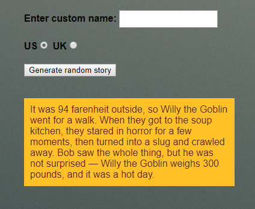

# Wikipedia-Viewer
In this mini-project I have developed a  web application that displays a random story with an input of the user with convert from pounds(lbs) to kg , as part of my full stack JavaScript training offered by [GOMYCODE Tunisia](https://www.gomycode.tn) and this is a link to the app:
## Project brief
This is a small web application wich does the following:

Generates a silly story when the "Generate random story" button is pressed.
Replaces the default name "Bob" in the story with a custom name, only if a custom name is entered into the "Enter custom name" text field before the generate button is pressed.
Converts the default US weight and temperature quantities and units in the story into UK equivalents if the UK radio button is checked before the generate button is pressed.
Will generate another random silly story if you press the button again (and again...)

The following screenshot shows my App:

    

